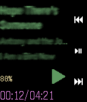
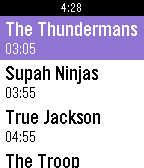

# bkbilly Website

Chechout my projects

### AlarmPI
Low cost DIY Security system with support for multiple sensors.

#### AlarmPI-Android
Android App for AlarmPI server.

#### snips-AlarmPI
Controlling the alarm state with voice commands through Snips Platform.

### Hikvision Site
This Web Application is a nice UI for all your hikvision cameras. It supports Login and it is using native HTML5 without the need to install any other plugin for the client.

### WebServices List
Web UI with a list of all the services with images and their status.

### Asterisk
#### Asterisk Call History
This application shows the call history of all calls from asterisk server (Master.csv).

#### snips-asterisk_voip
A skill for the Snips voice platform that uses linphone to make voip calls.

### SafeWords
Add One-Time Passcodes in the list and get them one by one.

### Pebble Watch
Applications that uploaded on Smart Watch Store.

#### Mopidy-Player
Controls from the Pebble watch the mopidy server.

#### Tvheadend-EPG
Shows the TV Program Guide from the TvHeadend server.

### Samba-Config

### Worker Exporter
This is an Exporter for Prometheus that runs any method that is needed, like shell commands, soap requests etc... It only supports results that are integer and it will try to convert to that.

### libHikvision
Python Library to extract videos/photos from HikVision camera datadirs.

### HackRF-data
Robot Communication 
